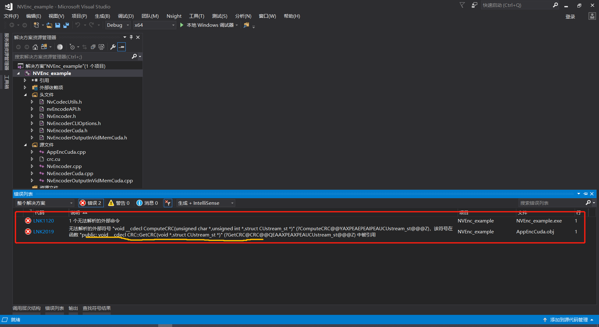

# VS中的C++工程使用CUDA“.cu”文件踩坑（20200805）

最近实习的项目中，需要使用英伟达的视频编解码SDK：**nvidia-video-codec-sdk**进行视频编码的的GPU加速，官方所给的视频编码例程中有一个文件**“crc.cu”**，从文件的类型可以知道，是需要使用CUDA的。

我一开始将官方例程中的源文件直接添加到自己的工程中，也在项目属性里面配置好了各种依赖库，结果编译的时候总是会报错，我一开始还以为是我漏掉了什么文件。

**报错如下：**

> 错误LNK2019无法解析的外部符号 
>
> "void __cdecl ComputeCRC(unsigned char *,unsigned int *,struct CUstream_st *)" (?ComputeCRC@@YAXPEAEPEAIPEAUCUstream_st@@@Z)，该符号在函数 "public: void __cdecl **CRC::GetCRC**(void *,struct CUstream_st *)" (?GetCRC@CRC@@QEAAXPEAXPEAUCUstream_st@@@Z) 中被引用	

**问题分析：**

看报错说是无法解析的外部符号，

从报错相关的函数可以知道是有关CUDA部分的东西出错了，所以我一开始在想是不是我CUDA的环境没有配置好，检查了好几遍，发现该设置的好像都设置了（其实是有一个地方没有设置好的，我以前没有使用VS做C++编程的经验，更没有过CUDA编程的经验），对着例程重复创建了一两个工程之后，报错仍然是一样的。

一开始只是百度这个错误关键词，网上说估计是某个lib之类的文件的问题，我弄来弄去也没有问题，后面派出了。

尝试了几次之后，还是挺郁闷的，不知道到底是怎么一回事。

**解决办法：**

终于在今天，我想到既然是有关CUDA的，我应该找找VS2017配置CUDA跟C++混合编程的教程来参考参考，发现利用CUDA的代码的时候，要设置生成属性，选择上CUDA才行。**终于让我看到了希望！**

参考[这一篇博文就够了](https://blog.csdn.net/p312011150/article/details/81571273)，主要是两个地方设置了一下：

> **右键项目 → 生成依赖项 → 生成自定义 → 勾选“CUDA 9.0XXX”**
>
> **右键 “xxx.cu" 源文件 → 属性 → 配置属性 → 常规 → 项类型 → 设置为“CUDA C/C++”**

