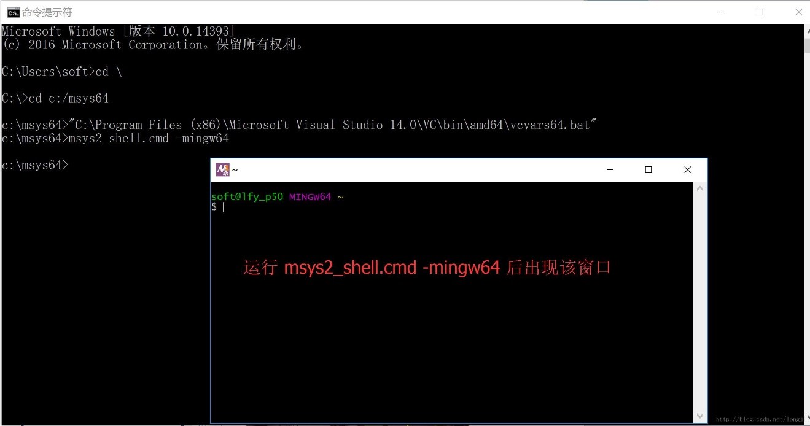
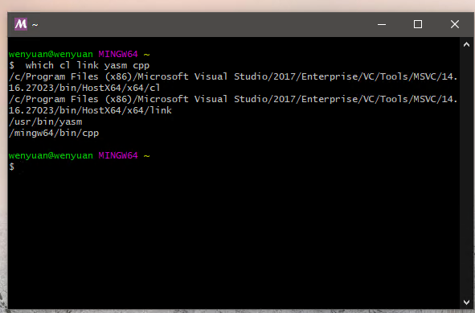
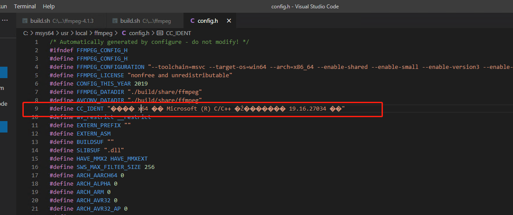
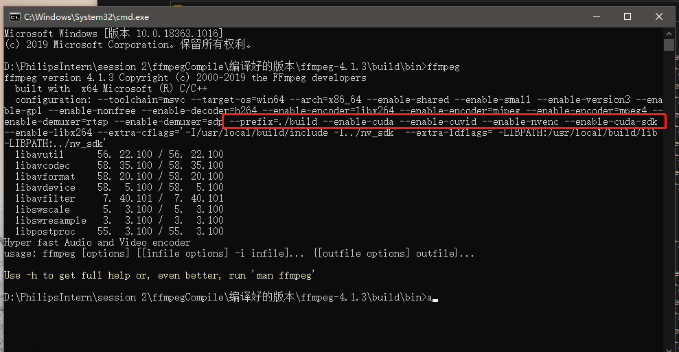

# FFmpeg编译小结(20200923)

1. 安装MSYS2,64位版本，http://www.msys2.org/

2. 安装msys后:

   - 重命名msys64/usr/bin/link.exe 为msys64/usr/bin/link.bak, 避免和MSVC 的link.exe冲突

   - 安装完成之后,先把安装目录下的msys2_shell.cmd中注释掉的rem set MSYS2_PATH_TYPE=inherit改成set MSYS2_PATH_TYPE=inherit这是为了将vs的环境继承给MSYS2。

   - 下载和安装YASM。http://yasm.tortall.net/Download.html

     下载其64位版本Win64 .exe (64 位 Windows 通用)，即页面中的Win64 .exe (for general use on 64-bit Windows)。下载后，将下载回来的yasm-1.3.0-win64.exe 改名为yasm.exe，并放置于 MSYS2 安装目录:/msys64/usr/bin/ 中

   - 安装各种所需的工具：GCC、Git、nasm等。pacman -S mingw-w64-x86_64-toolchain

3. 从开始菜单中的Visual Studio文件夹中，打开适用于 **VS 2017** **的 x64** **本机工具命令提示**（VS2019的话同理）

   打开之后输入以下命令，打开本机msys2的安装目录。

   ```shell
   1.	#进入msys2安装目录
   2.	c:
   3.	cd  c:\msys64
   4.	
   5.	#打开msys2的mingw64窗口
   6.	msys2_shell.cmd -mingw64
   ```

   

   使用命令： `which cl link yasm cpp`  检查工具组件，没出现no则代表没有缺少：

   

4. 编译libx264：（参考https://www.jianshu.com/p/5f175dec9109）

   1. 执行以下命令：

      ```shell
      1.	git clone http://git.videolan.org/git/x264.git
      2.	git checkout -b stable remotes/origin/stable
      3.	./configure --prefix=../build --host=x86_64-w64-mingw32 --enable-shared  --extra-ldflags=-Wl,--output-def=libx264.def 
      4.	make
      5.	make install
      ```

   2. 上面编译出来的结果没有包含lib文件，需要自己手工生成。configure时我们生成了libx264.def此时就派上用场。

      ```shell
      1.	cp ./libx264.def ../build/lib/
      2.	cd ../build/lib
      3.	#若要生成64位lib文件则输入如下命令：
      4.	lib /machine:X64 /def:libx264.def
      5.	
      6.	#若要生成32位lib文件则输入如下命令：
      7.	#lib /machine:i386 /def:libx264.def
      ```

      即得到libx264.lib，然后将build/bin/libx264-155.dll改名或者复制一份为libx264.dll。

      如果想在程序中直接使用x264的话，将include中的.h头文件、libx264.lib和libx264.dll复制到项目中对应位置，并且在程序中添加<stdint.h>头文件，然后就可以使用x264中的方法了。

   

   - 下载FFmpeg的源码，Ffmpeg源码放在了 usr/local/ffmpeg

   - 编译后的libx264放在了usr/local/build

   - 编译之后手动把libx264所需的依赖放在ffmpeg中

   - 编译时configure配置代码如下（创建了一个脚本**build.sh**）：

     ```shell
     6.		./configure --toolchain=msvc --target-os=win64 \
     7.	    --arch=x86_64 \
     8.	    --enable-shared \
     9.	    --enable-small \
     10.	    --enable-version3 \
     11.	    --enable-gpl \
     12.	    --enable-nonfree \
     13.	    --enable-decoder=h264 \
     14.	    --enable-encoder=libx264 \
     15.	    --enable-encoder=mjpeg \
     16.	    --enable-encoder=mpeg4 \
     17.	    --enable-demuxer=rtsp \
     18.	    --enable-demuxer=sdp \
     19.	    --prefix=./build \
     20.	    --enable-libx264 \
     21.	    --extra-cflags="-I/usr/local/build/include" \
     22.	    --extra-ldflags="-LIBPATH:/usr/local/build/lib"
     ```

     **注意：**Configure设置之后，config.h编码要设置成UTF-8，不然make的时候会有很多警告。

     并且config.h中第9行代码：

     ​    \#define CC_IDENT "用于 x64 的 Microsoft (R) C/C++ 优化编译器 19.26.28806 版"

        可能会由于中文编码问题出错，编译报错的话把其中乱码的**中文删掉**即可。

     

5. 编译支持nvenc：

   主要参考此博客：https://www.jianshu.com/p/032b47c48ada     

   **编译步骤：**

   1. 下载nv-codec-headers

      FFmpeg为NVIDIA的CUDA/NVENC/NVDEC相关库使用它自己稍微修改过的运行时加载器。需要安装**nv-codec-headers**，否则编译时会报错提示缺少`ffnvcodec：ERROR: cuda requested, but not all dependencies are satisfied: ffnvcodec`

      安装步骤如下：

      ```shell
      1.	git clone https://git.videolan.org/git/ffmpeg/nv-codec-headers.git
      2.	cd nv-codec-headers
      3.	make
      4.	sudo make install
      ```

      工程中一个Makefile: make install PREFIX=/usr。FFmpeg将查找它的pkg-config文件，名为ffnvcodec.pc。确保它位于PKG_CONFIG_PATH中。

      - **编译设置如下：**

      ```shell
      5.	    ./configure --toolchain=msvc --target-os=win64 \
      6.	    --arch=x86_64 \
      7.	    --enable-shared \
      8.	    --enable-small \
      9.	    --enable-version3 \
      10.	    --enable-gpl \
      11.	    --enable-nonfree \
      12.	    --enable-decoder=h264 \
      13.	    --enable-encoder=libx264 \
      14.	    --enable-encoder=mjpeg \
      15.	    --enable-encoder=mpeg4 \
      16.	    --enable-demuxer=rtsp \
      17.	    --enable-demuxer=sdp \
      18.	    --prefix=./build \
      19.	    --enable-cuda \
      20.	    --enable-cuvid \
      21.	    --enable-nvenc \
      22.	    --enable-cuda-sdk \
      23.	    --enable-libx264 \
      24.	    --extra-cflags="-I/usr/local/build/include -I../nv_sdk" \
      25.	    --extra-ldflags="-LIBPATH:/usr/local/build/lib -LIBPATH:../nv_sdk"
      ```

      - 编译成功后可以在ffmpeg中使用命令行测试是否能够成功使用nvenc进行视频编码

        

      - 按照别人教程的步骤在自己的电脑上编译没有遇到什么问题，毕竟CUDA都是能够正常使用的，编译之后一切正常。

      - 在没有GPU驱动以及CUDA的公司笔记本编译的时候没有编译成功，不知道是否是因为CUDA文件夹的环境变量的原因还是啥。


**Reference**

1. ​    https://blog.csdn.net/Archger/article/details/107835944
2. ​    https://www.jianshu.com/p/5f175dec9109
3. ​    http://www.adintr.com/article/blog/328
4. ​    https://trac.ffmpeg.org/wiki/CompilationGuide/WinRT
5. ​    https://trac.ffmpeg.org/wiki/CompilationGuide/MSVC
6. ​    https://blog.csdn.net/xiaoluer/article/details/84714769